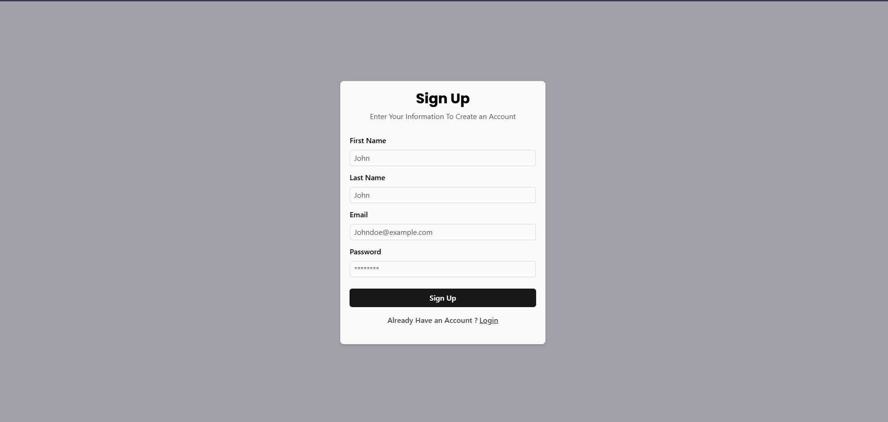
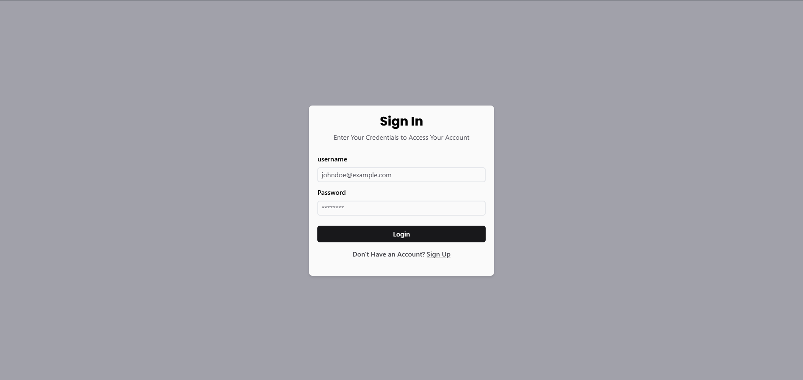
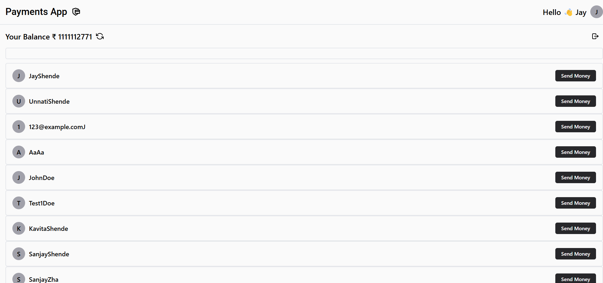
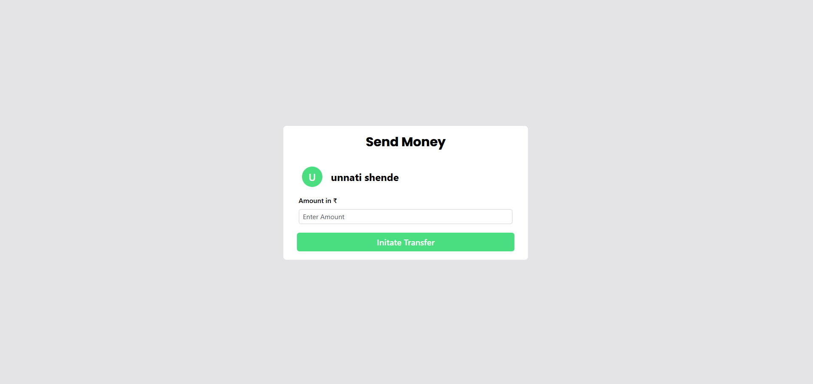

# Build a basic version of PayTM

## Tech. Stack Used

* JavScript
* NodeJS
* Express
* React JS
* MongoDB

## Library's Used

* jsonwebtokens - For Generating Toknes
* bcryptjs - For Hashing and Salting the Passwords
* mongoose - To Interact with the MongoDB Database
* zod -  For Input Validation
* cors - To Manage the Cross Origin Request Since Backend & Frontent Run Diffrently
* react-router-dom - To Manage the Routing in React Application
* axios -  To Communicate with the Backend
* nodemon - For Local Development Purpose

## Exposed API's

```json
http://localhost:3000/api/v1/user/signup
http://localhost:3000/api/v1/user/signin
http://localhost:3000/api/v1/user/test
http://localhost:3000/api/v1/user/
http://localhost:3000/api/v1/user/bulk/?filter=
http://localhost:3000/api/v1/account/balance
http://localhost:3000/api/v1/account/transfer
```

## **Pages**


